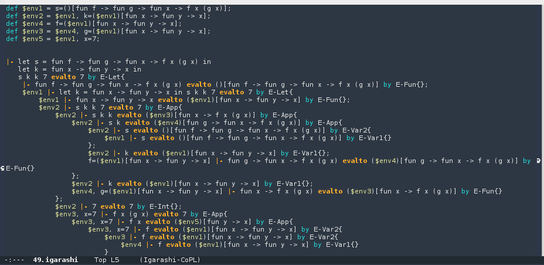

Igarashi-CoPL Mode
==================

Emacs major mode for the exercise system of 「プログラミング言語の基礎概念」 written by Jun Igarashi

## Description
A textbook about program semantics and type system 「プログラミング言語の基礎概念」 accompanies an exercise system on [Jun Igarashi's website](http://www.fos.kuis.kyoto-u.ac.jp/~igarashi/CoPL/index.cgi).  This Emacs major mode highlights keywords of the grammar used in the system.

## Screenshot


## Installation
1. Clone this repository.
2. Add these lines to your .emacs file:
```
(add-to-list 'load-path "(the path you cloned)")
(require 'igarashi-copl-mode)
```

## Usage
If the file has the extension ".igarashi", then Igarashi-CoPL mode automatically starts.  If you want to activate manually, type `M-x igarashi-copl-mode`.

## Author
ashiato45(@ashiato45)
